```python
<script>
  function code_toggle() {
    if (code_shown){
      $('div.input').hide('500');
      $('#toggleButton').val('Show Code')
    } else {
      $('div.input').show('500');
      $('#toggleButton').val('Hide Code')
    }
    code_shown = !code_shown
  }
 
  $( document ).ready(function(){
    code_shown=false;
    $('div.input').hide()
  });
</script>
<form action="javascript:code_toggle()"><input type="submit" id="toggleButton" value="Show Code"></form>

```

## HTML Version


```python
Please check out the following link to view HTML version of this page:

```

## Background

One of trendy topics in machine learning industry would be image classification. The concept of this project is to make prediction on “Street View House Number (SVHN)” from about 100k labelled real-world images which was collected was used by Google to match the real house number and its geolocation. This project includes data exploration which shows the distribution of colors among images with distinctive class labels. Visualization is another major part of this exerise which reveals how the images are displayed with different channel of colors (i.e. RGB and GrayScale). Modeling is the ultimate goal of this project, we will train models to make classification on the images with digits, so that the final trained model are potentially able to read and classify ten classes of digitals (i.e. 0-9). 


## Client and Audience

Classification is a current trendy and practical topic in machine learning industry. With rapid growing of mobile application and advanced camera technology, object recognition technique also becomes popular and demanding. Prior researches are already accomplished, Similar dataset MNIST is a perfect example that image with digits objects are able classified by machine learning algorithms (e.g. SVM). For this particular exercise, we will attempt to utilize Deep Learning techniques to tackle the "House Number" classification problem. The result of this study could be a reference for anyone who studes image classification or object recognition subjects.

## Questions to be addressed

** - Discover the distribution of colors among images with according class labels ** 

** - Visualize images with different channels of colors **

** - How’s the models perform differently with channels of colors**

** - Determine the best model(s) for classifying images with digits**

## Data Exploration

### Summary:

This dataset contains two separate files storing 99289 images with Ten class labels in total. The images are embeded in 4-dimenisional array format (i.e. Width, Length, Channels of Color, Size = Number of images). As shown below, all images are 32 x 32 pixels with 3 color channels (i.e. RGB). 


```python
import pandas as pd
import numpy as np
import scipy.io as sio
from PIL import Image
import math
import matplotlib.pyplot as plt
%matplotlib inline
```

### Load Dataset 


```python
'''Reshape the dataset format
    axes: 0=width, 1=Length, 2=no_of_channels, 3=no_of_images
    Original data : width * length * channels(RGB) *no_of_image 
    Reshaped data : no_of_image * width * length * channels(RGB) 
'''

def reshapeImage(arr):
    return(np.transpose(arr,axes=(3,0,1,2))) 

```


```python
mat= sio.loadmat("./data/train_32x32.mat")
mat2= sio.loadmat("./data/test_32x32.mat")
#mat3= sio.loadmat("./data/extra_32x32.mat")

image1 = reshapeImage(mat["X"])
image2 = reshapeImage(mat2["X"])
#image3 = reshapeImage(mat3["X"])

label1 = mat["y"]
label2 = mat2["y"]
#label3 = mat3["y"]

print("Original Data:",mat["X"].shape,mat2["X"].shape)
print("Reshaped Data:",image1.shape,image2.shape)
print("Target shape",label1.shape,label2.shape)
print()
imageAll = np.vstack((image1,image2))
labelAll = np.vstack((label1, label2))

print("Combined Data:", imageAll.shape)
print("Combined Label:", labelAll.shape)


```

    Original Data: (32, 32, 3, 73257) (32, 32, 3, 26032)
    Reshaped Data: (73257, 32, 32, 3) (26032, 32, 32, 3)
    Target shape (73257, 1) (26032, 1)
    
    Combined Data: (99289, 32, 32, 3)
    Combined Label: (99289, 1)


```python
from collections import Counter
c=Counter(list(labelAll.flatten()))
c=dict(c)

fig=plt.figure(figsize=(10,5))
for label in sorted(list(c.keys())):
    plt.bar(x=str(label),height=c[label])
plt.title("Distribution of Class Labels ")
plt.xlabel("Class Labels")
plt.ylabel("Count of Labels")
plt.show()
```


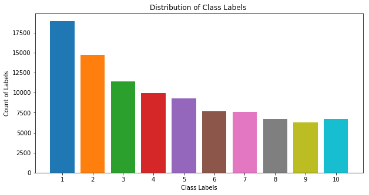


#### Class labels Distribution (1-10)
The above plot shows that the label "1" has the maximun count in the dataset. The Class "10" actually means "0" show on the images. 

## Visualization

#### Original Size Images (32x32x3):  
The following shows the images with theirs class labels. As shown, images might contains more than one digits on the same image and our goal is to only classify the center digit on the images. The quality of clarity on images varies, some of them are very manifest ; some of them are blurred. For this reason, the images are being tested by increasing the pixels of images to see whether the quality of clarity is improved. 


```python
fig=plt.figure(figsize=(10,12))
for i in range(1,26):
    pic=mat["X"][:,:,:,i]
    label=mat["y"][i][0]    
    ax=fig.add_subplot(5,5,i)
    #img = Image.fromarray(pic, 'RGB')
    ax.set_title("Class: "+str(label))
    ax.imshow(pic)
plt.show()
```


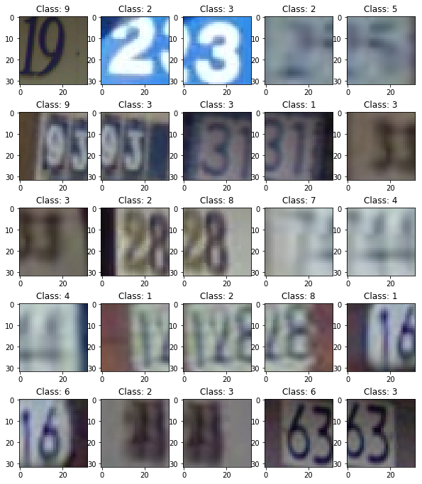


#### Enriched Image 128x128x3:
As we see below, the quality of clarity of images with higher resolution are being improved. The change is not very apparent to our human eyes, however, some of the digits' edges are more smoothed / shaped than before. This result might offers us hints that the change of colors / pixels of images might help for boosting images classification. So that, we will observe the channels of colors as well as the grayscale individually in the later sections.


```python
fig=plt.figure(figsize=(10,12))
for i in range(1,26):
    pic=mat["X"][:,:,:,i]
    label=mat["y"][i][0]    
    fig.add_subplot(5,5,i)
    pic = Image.fromarray(pic, 'RGB')
    pic.thumbnail((128, 128), Image.ANTIALIAS) # resizes image in-place
    plt.title("Class: "+str(label))
    plt.imshow(pic, interpolation="bicubic")
plt.show()
```


#### Image in three Individual channel (Colors): R / G / B
The following shows the three separated channel of colors of the two images. As we observed, the visualized effect is completely different from the above. The boundary of digits are more stand out from the background on all three individual layers although their intensity (i.e. Darker or lighter) of color are varied. For the goal of this project, we should consider to utilize this monotonous color to make prediction on these images. The next part we will find another type of comon color (i.e. Grayscale) of images for machine learning purpose.


```python
fig=plt.figure(figsize=(10,16))
colors=["R","G","B"]
j=1
for i in [27,1932]:
    for layer in range(0,3):
        pic=mat["X"][:,:,:,i]
        pic=pic[:,:,layer]
        label=mat["y"][i][0]    
        fig.add_subplot(5,3,j)
        plt.title("Class: %s, Channel: %s"%(str(label), colors[layer]))
        plt.imshow(pic, interpolation="bicubic")
        j+=1
plt.show()
```


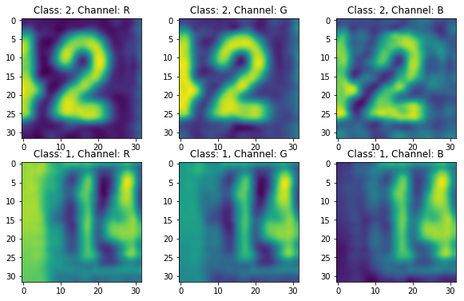


#### Images in GrayScale: 
There are many different ways to visualize GrayScale images, there are three methods were researched are practiced in this exercise as shown following:

-  Dot product of RBG image with a normalized vector : *Gray Vector = 0.2989R + 0.5870B + 0.1140G*
   - In Python: np.dot(original_images, [0.2989, 0.5870, 0.1140]), axis=3)
   - Return ONE channel of color (e.g. Convert [32,32,3] to  [32,32,1]) 


-  Skimage library from Sklearn library : 
   - In Python: rgb2gray(original_images)
   - Return ONE channel of color (e.g. Convert [32,32,3] to  [32,32,1]) 


-  Calculate the Mean value of last color channel : 
   - In Python: original_images.mean(axis=-1,keepdims=1) 
   - Return THREE channel of colors (e.g. Convert [32,32,3] to  [32,32,3]) 
   
The GrayScale images from all three different methods comes out very similar outcomes. Comparing with the above, the boundary of digits are more stand out from the original channel of colors. In this case, I would propose to use the greyscale set of data to build the classifiers to achieve our project goal. 


```python
'''Display images in series'''
def plot_series_image(images, labels,start, end):
    cols=7
    fig=plt.figure(figsize=(12,12))
    for i in range(start,end):
        pic=images[i]
        label=labels[i][0]
        ax=fig.add_subplot(math.ceil((end-start)/cols ),cols,i-start+1)
        
        #options to plot RBG or 1 channel
        if pic.shape[2]==3:
            ax.imshow(pic)
        else:
            ax.imshow(pic[:,:,0], cmap="binary")
        plt.title("Class: "+str(label))
    plt.show()
    
#plot_series_image(RBG2GrayFunc(images), mat["y"],1,36)
```

#### Method 1: Dot product of RBG image with a normalized vector : Gray Vector = 0.2989R + 0.5870B + 0.1140G


```python
grays=np.expand_dims(np.dot(imageAll, [0.2989, 0.5870, 0.1140]), axis=3).astype(np.float32)
plot_series_image(grays, labelAll,2000, 2030)
```


#### Method 2: Skimage library from Sklearn library


```python
from skimage.color import rgb2gray
from skimage import data

grays = rgb2gray(imageAll)
grays=grays.reshape(grays.shape[0],grays.shape[1],grays.shape[2],1)
plot_series_image(grays, labelAll,3000, 3030)
```


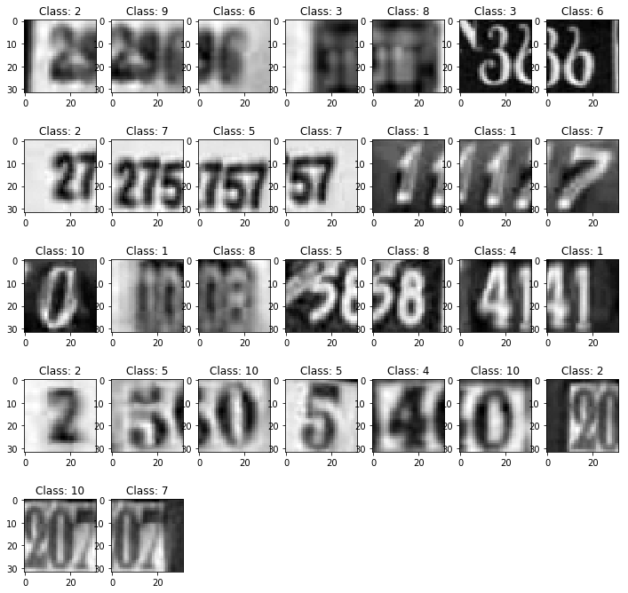


#### Method 3: Calculate the Mean value of last color channel


```python
def RBG2GrayFunc(images):
    images[:] = images.mean(axis=-1,keepdims=1) 
    return (images)

#images=reshapeImage(mat["X"])
grays=RBG2GrayFunc(imageAll)
plot_series_image(grays, labelAll,5000, 5030)
```


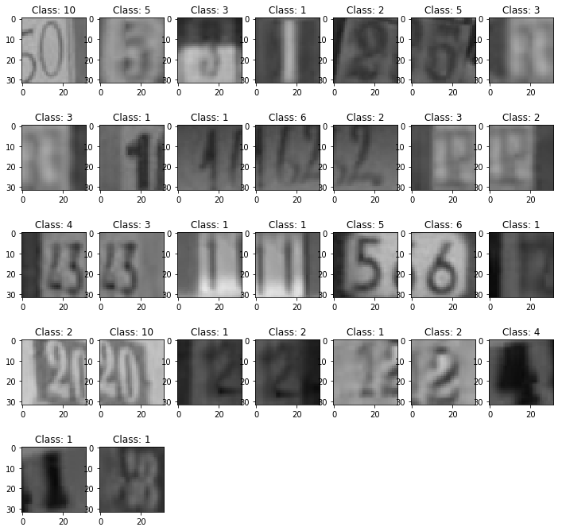


## Data Distribution for 10 Classes
The following shows the color distribution of each class of images. Unfortunately, it is very hard to find any correlation of colors with Target class labels. In this case, we will do data dimenision reduction (i.e. PCA) in the next part to check any particular pattern of data verus the Target labels.


```python
'''Function to plot First 10 Images for each Class'''
def PlotHist(input_array,class_label):    
    idx_lst = np.where(input_array.ravel()== int(class_label))[0]

    fig=plt.figure(figsize=(15,2))
    for i in range(1,11):
        fig.add_subplot(1,11,i)
        pic=mat["X"][:,:,:,idx_lst[i]]    
        plt.hist(pic.ravel(), bins=256, color="orange",)
        if i >1: plt.yticks([])
    fig.suptitle('Class %s Distribution'%(str(class_label)), fontsize=15)
    plt.show()
```


```python
for i in  list(np.unique(mat["y"])):
    PlotHist(mat["y"],i)
```


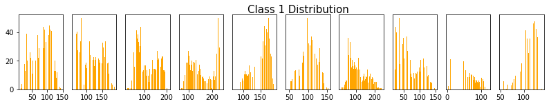


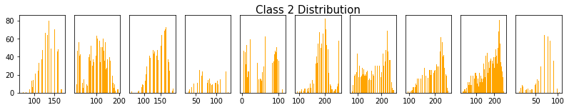


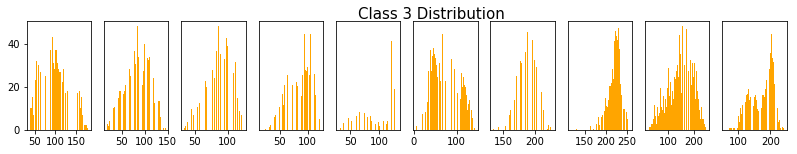


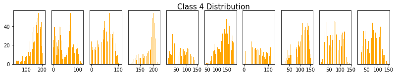


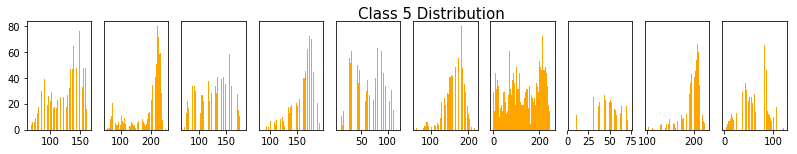


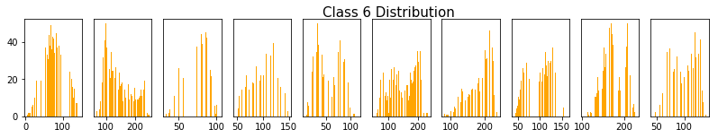


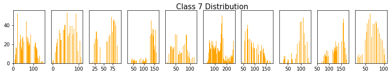


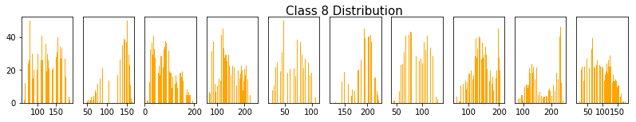


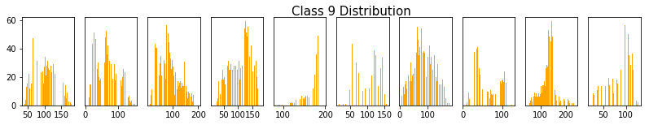


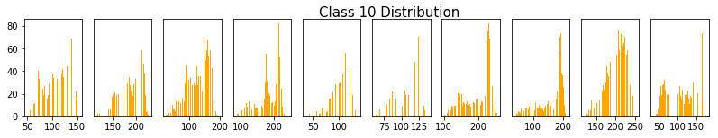


## Dimenision Reduction PCA
The following plots show the Principal Component(n=2) of original data and normalized data for 10-class labels. As shown, it is hard to find any correlations between class labels. The data points are mostly piled up along the x-y axis. The major difference of plots are the range of components of original data is a lot wider than the range of components of normalized data. This outcome are as expected because normalized data features are all rescaled into one standard range. For the purpose of modeling, utilizing normalized data not only able to lower computation space also avoiding chance of bias on updating weights backprogation procedure in Deep Learning process (i.e. If we use not normalized data for learning process, the distributon of some features with larger values might over compensating the correction during backprogation; the features with smaller values might just under compensating the corrections). For the above reasons, I would propose to utilize the normalized data for the Deep Learning modeling process.  


```python
flatten_image=[]
for i in range(0,imageAll.shape[0]):
    flatten_image.append(imageAll[i].flatten())

flatten_image=np.array(flatten_image)
flatten_image.shape
```


    (99289, 3072)


```python
from sklearn.decomposition import PCA
pca=PCA(n_components=2)
pcaImageAll=pca.fit_transform(flatten_image)
pcaImageAll.shape
```


    (99289, 2)


```python
fig=plt.figure(figsize=(14,7))

for i in range(1,11):
    idx_lst = np.where(labelAll.flatten()== int(i))[0]
    plt.scatter(pcaImageAll[idx_lst][:,0], pcaImageAll[idx_lst][:,1],cmap="cm", alpha=0.5)
plt.legend(title="Class Label",
           labels=('1', '2', '3', '4', '5', '6', '7','8','9','10'),
           scatterpoints=1,
           loc='upper right',
           ncol=3,
           fontsize=8)

plt.xlabel("component 1")
plt.ylabel("component 2")
plt.title("Original Data")
plt.axvline(x=0, color="red")
plt.axhline(y=0, color="red")
plt.show()
```


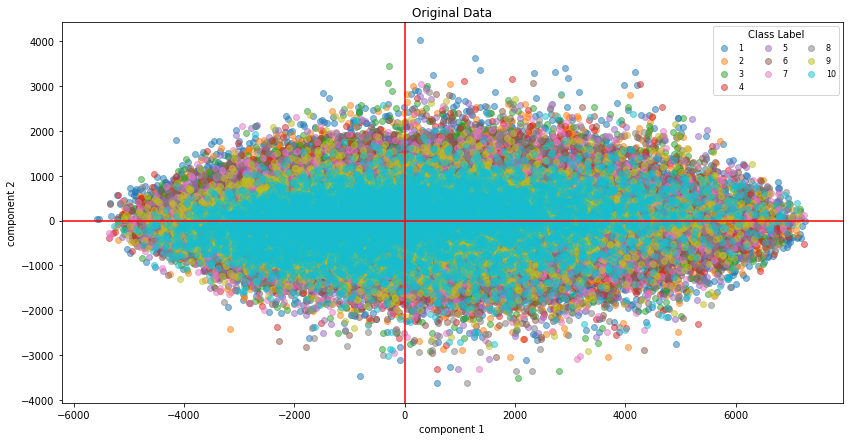


```python
'''Normalization'''
grays = rgb2gray(imageAll) #RBG to Gray 
grays=grays.reshape(grays.shape[0],grays.shape[1],grays.shape[2],1)

grays_mean=np.mean(grays, axis=0)
grays_std=np.std(grays, axis=0)

grays_norm=(grays-grays_mean) / grays_std

#print(grays_norm.shape)

'''Save the Normalizated data and labels to pickle for modeling purpose'''
import pickle
with open("./data/imagePickle", "wb") as file:
    pickle.dump(grays_norm, file)
    
with open("./data/labelPickle", "wb") as file:
    pickle.dump(labelAll, file)  
```

    (99289, 32, 32, 1)


```python
flatten_grays_norm=[]
for i in range(0,grays_norm.shape[0]):
    flatten_grays_norm.append(grays_norm[i].flatten())

flatten_grays_norm=np.array(flatten_grays_norm)
flatten_grays_norm.shape
```


    (99289, 1024)


```python
from sklearn.decomposition import PCA
pca=PCA(n_components=2)
pca_flatten_grays_norm=pca.fit_transform(flatten_grays_norm)
pca_flatten_grays_norm.shape
```


    (99289, 2)


```python
fig=plt.figure(figsize=(14,7))

for i in range(1,11):
    idx_lst = np.where(labelAll.flatten()== int(i))[0]
    plt.scatter(pca_flatten_grays_norm[idx_lst][:,0], 
                pca_flatten_grays_norm[idx_lst][:,1],cmap="cm", alpha=0.5)
plt.legend(title="Class Label",
           labels=('1', '2', '3', '4', '5', '6', '7','8','9','10'),
           scatterpoints=1,
           loc='upper right',
           ncol=3,
           fontsize=8)

plt.xlabel("component 1")
plt.ylabel("component 2")
plt.title("Normalized data")
plt.axvline(x=0, color="red")
plt.axhline(y=0, color="red")
plt.show()
```


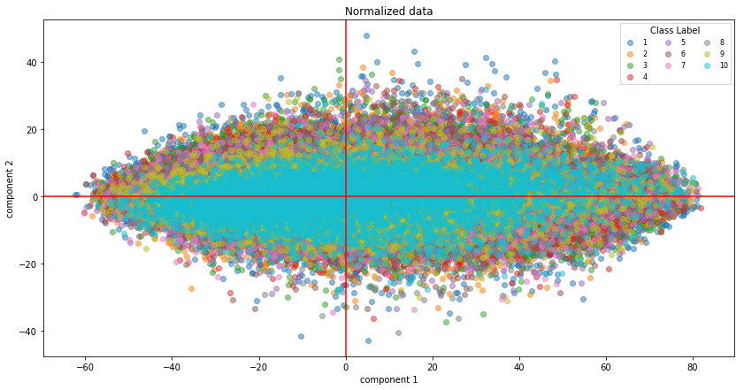


## Color to GreyScale (Method 1)


```python
images=reshapeImage(mat["X"])
images=np.expand_dims(np.dot(images, [0.2989, 0.5870, 0.1140]), axis=3).astype(np.float32)
plt.imshow(images[0,:,:,0], cmap="binary")
plt.show()
```


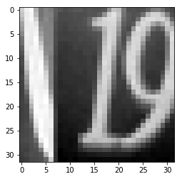


## Color to GreyScale (Method 2)


```python
from skimage.color import rgb2gray
from skimage import data

images=reshapeImage(mat["X"])
print(images.shape)

grays = rgb2gray(images)
grays=grays.reshape(grays.shape[0],grays.shape[1],grays.shape[2],1)

print(grays.shape)
plt.imshow(grays[0,:,:,0], cmap="gray")
plt.show()
```

    (73257, 32, 32, 3)
    (73257, 32, 32, 1)


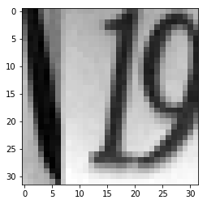


## Color to GreyScale (Method 3)


```python
'''Reshape the dataset format
    axes: 0=width, 1=Length, 2=no_of_channels, 3=no_of_images
    Original data : width * length * channels(RGB) *no_of_image 
    Reshaped data : no_of_image * width * length * channels(RGB) 
'''

def reshapeImage(arr):
    return(np.transpose(arr,axes=(3,0,1,2))) 

#reshapeImage(mat["X"]).shape
```


```python
'''
Convert Images to grey scale colors
'''
def RBG2GrayFunc(images):
    images[:] = images.mean(axis=-1,keepdims=1) 
    return (images)

images=reshapeImage(mat["X"])
grays=RBG2GrayFunc(images)
```


```python
'''Display images in series'''
def plot_series_image(images, labels,start, end):
    cols=7
    fig=plt.figure(figsize=(12,12))
    for i in range(start,end):
        pic=images[i]
        label=labels[i][0]
        ax=fig.add_subplot(math.ceil((end-start)/cols ),cols,i-start+1)
        
        #options to plot RBG or 1 channel
        if pic.shape[2]==3:
            ax.imshow(pic)
        else:
            ax.imshow(pic[:,:,0], cmap="binary")
        plt.title("Class: "+str(label))
    plt.show()
    
#plot_series_image(RBG2GrayFunc(images), mat["y"],1,36)
```

## Normalize GrayScale images color values from Skimage method 2


```python
import pandas as pd
import numpy as np
import scipy.io as sio
from PIL import Image
import math
from skimage.color import rgb2gray
from skimage import data
import pickle
import matplotlib.pyplot as plt
%matplotlib inline
```


```python
mat= sio.loadmat("./data/train_32x32.mat")
mat2= sio.loadmat("./data/test_32x32.mat")
#mat3= sio.loadmat("./data/extra_32x32.mat")

image1 = reshapeImage(mat["X"])
image2 = reshapeImage(mat2["X"])
#image3 = reshapeImage(mat3["X"])

label1 = mat["y"]
label2 = mat2["y"]
#label3 = mat3["y"]

print("Original Data:",mat["X"].shape,mat2["X"].shape)
print("Reshaped Data:",image1.shape,image2.shape)
print("Target shape",label1.shape,label2.shape)
print()
imageAll = np.vstack((image1,image2))
labelAll = np.vstack((label1, label2))

print("Combined Data:", imageAll.shape)
print("Combined Label:", labelAll.shape)
```

    Original Data: (32, 32, 3, 73257) (32, 32, 3, 26032)
    Reshaped Data: (73257, 32, 32, 3) (26032, 32, 32, 3)
    Target shape (73257, 1) (26032, 1)
    
    Combined Data: (99289, 32, 32, 3)
    Combined Label: (99289, 1)


```python
#images=reshapeImage(mat3["X"])
grays = rgb2gray(imageAll) #RBG to Gray 
grays=grays.reshape(grays.shape[0],grays.shape[1],grays.shape[2],1)

grays_mean=np.mean(grays, axis=0)
grays_std=np.std(grays, axis=0)

grays_norm=(grays-grays_mean) / grays_std

print(grays_norm.shape)


```


```python
plot_series_image(grays_norm,labelAll,1000,1030)
```


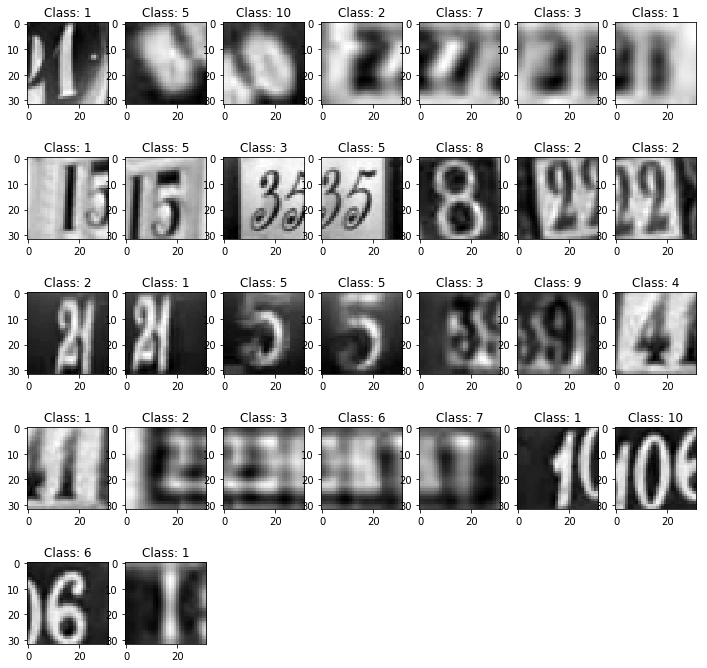


```python
import pickle

with open("./data/imagePickle", "wb") as file:
    pickle.dump(grays_norm, file)
    
with open("./data/labelPickle", "wb") as file:
    pickle.dump(labelAll, file)    
```


```python
with open("./data/imagePickle", "rb") as file:
    X=pickle.load(file)
with open("./data/labelPickle", "rb") as file:
    y=pickle.load(file)    

print(X.shape, y.shape)
```

    (99289, 32, 32, 1) (99289, 1)


## Use Gamma  and adjust log to adjust contrast of images


```python
from skimage import data, img_as_float
from skimage import exposure

img=grays[21]
# Gamma
gamma_corrected = exposure.adjust_gamma(grays[22], 1.3)

# Logarithmic
#logarithmic_corrected = exposure.adjust_log(img, 0.5)

plt.imshow(gamma_corrected)
```

## Modeling


```python
to_categorical(y_train)[0]
```


```python
from sklearn.model_selection import train_test_split
import pickle
#Reopen the X and y file
with open("./data/imagePickle", "rb") as file:
    X=pickle.load(file)
with open("./data/labelPickle", "rb") as file:
    y=pickle.load(file)    

print(X.shape, y.shape)


X_train, X_test, y_train, y_test = train_test_split(X, y, test_size=0.33, random_state=42)


print("X train shape:",X_train.shape)
print("y train shape:",y_train.shape)
print()
print("X test shape:", X_test.shape)
print("y test shape:", y_test.shape)

```

    (99289, 32, 32, 1) (99289, 1)
    X train shape: (66523, 32, 32, 1)
    y train shape: (66523, 1)
    
    X test shape: (32766, 32, 32, 1)
    y test shape: (32766, 1)


```python
from collections import Counter
c=Counter(list(y_train.flatten()))
c=dict(c)
fig=plt.figure(figsize=(14,5))

for label in sorted(list(c.keys())):
    ax=fig.add_subplot(1,2,1)
    ax.bar(x=str(label),height=c[label])

plt.title("Distribution of Class Labels for Train set")
plt.xlabel("Class Labels")
plt.ylabel("Count of Labels")

c=Counter(list(y_test.flatten()))
c=dict(c)
for label in sorted(list(c.keys())):
    ax=fig.add_subplot(1,2,2)
    ax.bar(x=str(label),height=c[label])
plt.title("Distribution of Class Labels for Test set")
plt.xlabel("Class Labels")

plt.show()
```

    /Users/KevQuant/anaconda/lib/python3.6/site-packages/matplotlib/figure.py:98: MatplotlibDeprecationWarning: 
    Adding an axes using the same arguments as a previous axes currently reuses the earlier instance.  In a future version, a new instance will always be created and returned.  Meanwhile, this warning can be suppressed, and the future behavior ensured, by passing a unique label to each axes instance.
      "Adding an axes using the same arguments as a previous axes "


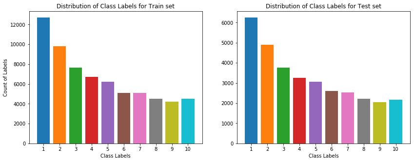


```python
# MODEL
from keras.models import Sequential
from keras.layers import Conv2D, MaxPooling2D
from keras.layers import Activation, Dropout, Flatten, Dense
from keras.callbacks import ModelCheckpoint
from keras.utils import to_categorical

input_shape = X[0].shape

model = Sequential()
model.add(Conv2D(32, (3, 3), input_shape=input_shape))
model.add(Activation('relu'))
model.add(MaxPooling2D(pool_size=(2, 2)))

model.add(Conv2D(64, (3, 3)))
model.add(Activation('relu'))
model.add(MaxPooling2D(pool_size=(2, 2)))

model.add(Conv2D(128, (3, 3)))
model.add(Activation('relu'))
model.add(MaxPooling2D(pool_size=(2, 2)))

model.add(Flatten())
# Step 4 - Full connection
model.add(Dense(units = 128, activation = 'relu'))
model.add(Dense(units = 64, activation = 'relu'))
model.add(Dense(units = 11, activation = 'softmax'))


model.compile(loss='categorical_crossentropy',
              optimizer='adam',
              metrics=['accuracy'])


#To save the best model by monitor the "Validation Loss"
checkpoint = ModelCheckpoint(filepath="./model/m1.h5", 
                             monitor='val_loss', #Model saved based on Improved Accuracy
                             verbose=1, 
                             save_best_only=True, 
                             mode='min')

callbacks_lst = [checkpoint]

batch_size=200
epoch=10
history=model.fit(X_train, to_categorical(y_train),
          batch_size=batch_size,
          epochs=epoch,
          verbose=1,
          validation_data=(X_test, to_categorical(y_test)),
          callbacks=callbacks_lst)


```

    Train on 66523 samples, validate on 32766 samples
    Epoch 1/10
    66523/66523 [==============================] - 210s 3ms/step - loss: 1.0334 - acc: 0.6733 - val_loss: 0.5679 - val_acc: 0.8398
    
    Epoch 00001: val_loss improved from inf to 0.56786, saving model to ./model/m1.h5
    Epoch 2/10
    66523/66523 [==============================] - 186s 3ms/step - loss: 0.5014 - acc: 0.8588 - val_loss: 0.4370 - val_acc: 0.8789
    
    Epoch 00002: val_loss improved from 0.56786 to 0.43698, saving model to ./model/m1.h5
    Epoch 3/10
    66523/66523 [==============================] - 185s 3ms/step - loss: 0.3991 - acc: 0.8862 - val_loss: 0.3741 - val_acc: 0.8932
    
    Epoch 00003: val_loss improved from 0.43698 to 0.37413, saving model to ./model/m1.h5
    Epoch 4/10
    66523/66523 [==============================] - 183s 3ms/step - loss: 0.3414 - acc: 0.9014 - val_loss: 0.3624 - val_acc: 0.8967
    
    Epoch 00004: val_loss improved from 0.37413 to 0.36237, saving model to ./model/m1.h5
    Epoch 5/10
    66523/66523 [==============================] - 184s 3ms/step - loss: 0.2997 - acc: 0.9135 - val_loss: 0.3311 - val_acc: 0.9060
    
    Epoch 00005: val_loss improved from 0.36237 to 0.33110, saving model to ./model/m1.h5
    Epoch 6/10
    66523/66523 [==============================] - 194s 3ms/step - loss: 0.2740 - acc: 0.9211 - val_loss: 0.3170 - val_acc: 0.9096
    
    Epoch 00006: val_loss improved from 0.33110 to 0.31701, saving model to ./model/m1.h5
    Epoch 7/10
    66523/66523 [==============================] - 189s 3ms/step - loss: 0.2478 - acc: 0.9278 - val_loss: 0.3226 - val_acc: 0.9081
    
    Epoch 00007: val_loss did not improve from 0.31701
    Epoch 8/10
    66523/66523 [==============================] - 188s 3ms/step - loss: 0.2265 - acc: 0.9339 - val_loss: 0.2976 - val_acc: 0.9152
    
    Epoch 00008: val_loss improved from 0.31701 to 0.29760, saving model to ./model/m1.h5
    Epoch 9/10
    66523/66523 [==============================] - 187s 3ms/step - loss: 0.2063 - acc: 0.9409 - val_loss: 0.3064 - val_acc: 0.9127
    
    Epoch 00009: val_loss did not improve from 0.29760
    Epoch 10/10
    66523/66523 [==============================] - 190s 3ms/step - loss: 0.1883 - acc: 0.9460 - val_loss: 0.3072 - val_acc: 0.9138
    
    Epoch 00010: val_loss did not improve from 0.29760


```python
history.history
```


    {'acc': [0.6732708983532215,
      0.8588307822427839,
      0.88621980068249,
      0.9014175522161305,
      0.9135486987807184,
      0.9211099937549438,
      0.9277693436122952,
      0.9339025605804206,
      0.940877590496735,
      0.9460186660527204],
     'loss': [1.0333634946160022,
      0.5014203632728921,
      0.3991263381125573,
      0.3414293726085192,
      0.29965397657373305,
      0.273957431781848,
      0.24781256304768817,
      0.22645411504471172,
      0.2062520750540419,
      0.18831157960294342],
     'val_acc': [0.8398339742379537,
      0.8788683362978686,
      0.8932124725782572,
      0.8966611699256706,
      0.9060306411875712,
      0.9096014190744671,
      0.9080754419549848,
      0.9152475137679428,
      0.9126838807737202,
      0.9138436204441329],
     'val_loss': [0.5678580240809509,
      0.4369848959849648,
      0.3741257802194956,
      0.36236978055269065,
      0.3310967525985152,
      0.3170061392392066,
      0.32258000262984354,
      0.29759899374985077,
      0.3063933962792011,
      0.3071791276436676]}


```python
## RGB to B/W
## OpenCV
## Calculate pixel 
```
